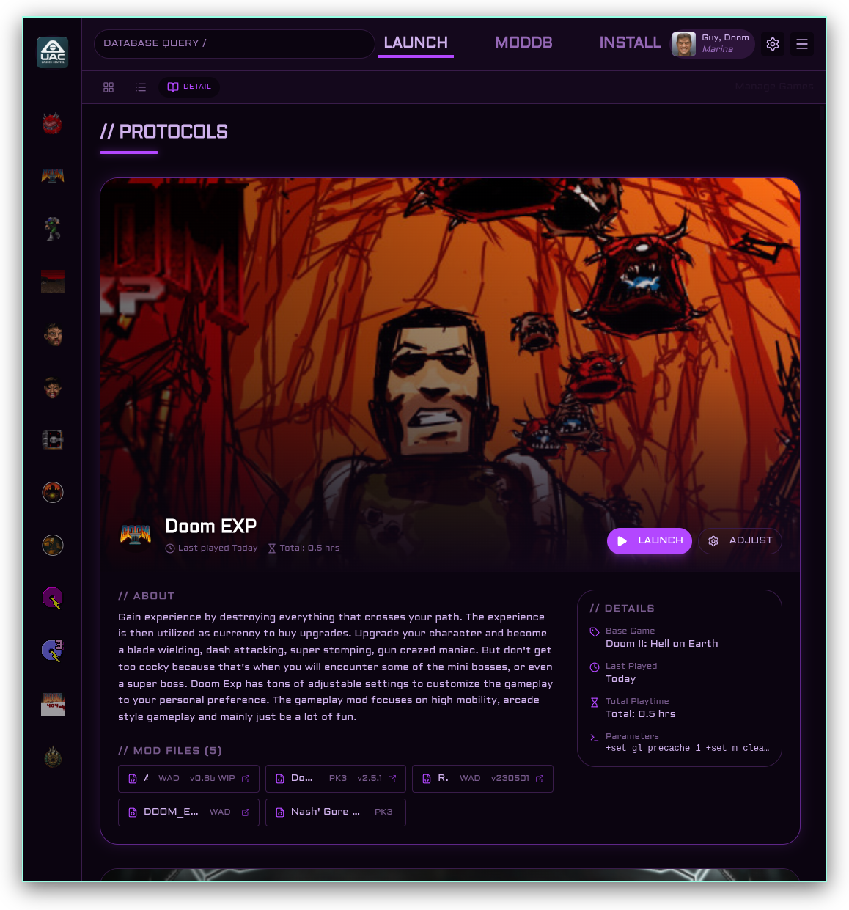

import { Card, CardGrid } from '@astrojs/starlight/components';

## What is Launch Control?

**UAC Launch Control** is a cross-platform desktop application that lets you manage, configure, and launch modded Doom games with any source port — all from one clean interface. Think of it as mission control for your Doom mod collection.

No more wrangling batch files, remembering command-line arguments, or manually tracking load orders. Just point the app at your source port, import your WADs and mods, and launch with a single click.

Available for **Windows**, **macOS**, and **Linux**.

---

## What it does

<CardGrid>
  <Card title="Launch with one click" icon="rocket">
    Set up game instances — protocols — combining a base game (Doom, Doom II, Heretic, FreeDoom, etc.), a source port, and your mods — then launch everything with a single click.
  </Card>
  <Card title="Manage multiple source ports" icon="window">
    Add several engine executables (GZDoom, UZDoom, Zandronum, etc.) and pick which one to use per protocol. Set a default, hide ones you don't need.
  </Card>
  <Card title="Keep a mod catalog" icon="seti:folder">
    Build a searchable library of your mod files with names, versions, and URLs. Add files via drag-and-drop and set their load order visually.
  </Card>
  <Card title="Import your IWADs" icon="add-document">
    Drop in your WAD files (doom2.wad, freedoom1.wad, heretic.wad, etc.) — the app auto-detects known ones and gives each a proper name and icon.
  </Card>
  <Card title="Community metadata" icon="server">
    Opt into the UAC Registry to automatically fetch mod metadata from a community database — or contribute metadata anonymously when you add new files.
  </Card>
  <Card title="Switch up the look" icon="list-format">
    Choose from four visual themes: dark industrial (UAC PHOBOS), bright (MAYKR), terminal green (PLUTONIA TERMINAL), or define your own HSL palette.
  </Card>
</CardGrid>

## Quick Start

1. **[Download UAC Launch Control](/installation/)** for your platform
2. **Add a source port** like GZDoom in Settings → Paths
3. **Import a base game WAD** — `doom2.wad`, `freedoom2.wad`, or any IWAD
4. **Create a protocol** — pick your base game, source port, and mods, set the load order
5. **Launch!**

## Ready to dive in?

Head over to **[Getting Started](/getting-started/)** for a full walk-through, or check the sidebar for guides on specific topics like [managing source ports](/guides/source-ports/), [adding mod files](/guides/mod-files/), and [importing WADs](/guides/base-game-wad/).

> **Want to contribute or build from source?** See the **[For Developers](/developers/)** page for architecture docs, API endpoints, and build instructions.
